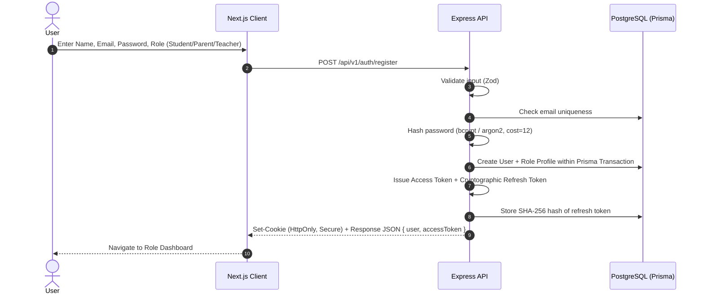
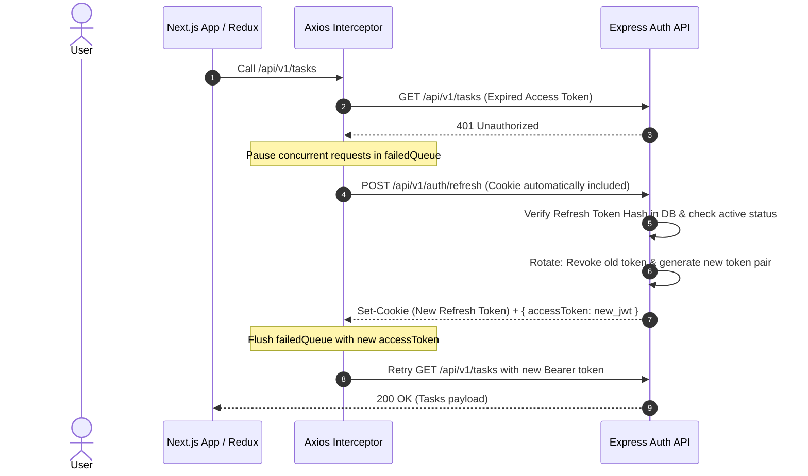

# StudyOS Authentication Architecture

## 1. Authentication Philosophy
StudyOS enforces industry standard token security with short-lived JSON Web Tokens (JWT) for stateless API access combined with stateful, rotating, database-backed refresh tokens sent exclusively over HttpOnly, Secure, SameSite cookies.

---

## 2. Token Specifications

| Token Type | Lifespan | Storage Medium | Payload / Contents | Revocability |
|---|---|---|---|---|
| **Access Token** | 15 Minutes | In-Memory (Axios memory / Redux session) | `{ userId, email, role, profileId, iat, exp }` | Short expiry (stateless) |
| **Refresh Token** | 7 Days | `HttpOnly`, `Secure`, `SameSite=Lax` Cookie (`/api/v1/auth`) | 64-character random cryptotoken (SHA-256 hashed in DB) | Instant via DB revocation |

---

## 3. Detailed Authentication Workflows

### 3.1 Registration Flow

### 3.2 Login Flow
1. Client calls `POST /api/v1/auth/login` with `{ email, password }`.
2. Rate-limiter checks IP/Email attempts (max 5 failed attempts per 15 min window).
3. Backend validates credentials against stored password hash.
4. Generates a fresh access token (15m) and a 64-byte refresh token.
5. Hashes the refresh token and saves to `RefreshToken` table with `expiresAt = now + 7d`.
6. Sets `studyos_refresh` cookie with flags: `HttpOnly=true`, `Secure=true` (in prod), `SameSite=Lax`, `Path=/api/v1/auth`.
7. Returns user profile, permissions, and `accessToken`.

### 3.3 Silent Token Refresh & Race Condition Prevention

---

## 4. Frontend Auth State Management
- Stored in Redux `authSlice`:
  - `user`: Safe user representation (`id`, `email`, `role`, `firstName`, `lastName`, `avatarUrl`, `profileId`).
  - `isAuthenticated`: Boolean.
  - `isLoading`: Boolean.
- The refresh token is **NEVER** stored in Redux, `localStorage`, or `sessionStorage`.
- On application bootstrap, `useAuth` invokes `/api/v1/auth/me` to hydrate session seamlessly if a valid refresh cookie exists.
