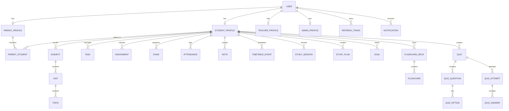

# StudyOS Database Architecture & Schema Design

## 1. Overview
StudyOS uses PostgreSQL 16 managed via Prisma ORM. The relational model is normalized to Third Normal Form (3NF), utilizes UUIDv4 for all primary keys, enforces foreign-key referential integrity with cascading where appropriate, and leverages compound indexes for performance.

---

## 2. Entity Relational Model

---

## 3. Data Dictionary

### User & Authentication
- **`User`**:
  - `id`: UUID (PK)
  - `email`: VARCHAR(255) (Unique, Indexed)
  - `passwordHash`: VARCHAR(255)
  - `role`: Enum (`STUDENT`, `PARENT`, `TEACHER`, `ADMIN`)
  - `firstName`: VARCHAR(100)
  - `lastName`: VARCHAR(100)
  - `avatarUrl`: VARCHAR(500) (Nullable)
  - `isActive`: BOOLEAN (Default: true)
  - `isEmailVerified`: BOOLEAN (Default: false)
  - `createdAt`, `updatedAt`: Timestamps

- **`RefreshToken`**:
  - `id`: UUID (PK)
  - `userId`: UUID (FK $\rightarrow$ User.id)
  - `tokenHash`: VARCHAR(255) (SHA-256 hashed, Indexed)
  - `expiresAt`: TIMESTAMP
  - `revokedAt`: TIMESTAMP (Nullable)
  - `replacedByToken`: VARCHAR(255) (Nullable)
  - `createdAt`: TIMESTAMP

### Profiles
- **`StudentProfile`**: `id`, `userId` (Unique FK), `gradeLevel`, `targetGpa`, `schoolName`, `bio`, timestamps.
- **`ParentProfile`**: `id`, `userId` (Unique FK), `phoneNumber`, timestamps.
- **`TeacherProfile`**: `id`, `userId` (Unique FK), `department`, `title`, timestamps.
- **`AdminProfile`**: `id`, `userId` (Unique FK), `permissions`, timestamps.
- **`ParentStudent`**: `id`, `parentId` (FK $\rightarrow$ ParentProfile), `studentId` (FK $\rightarrow$ StudentProfile), `relationship`, `isApproved` (BOOLEAN), `createdAt`. Unique composite: `[parentId, studentId]`.

### Academic Structure
- **`Subject`**: `id`, `studentId` (FK), `name`, `code`, `color`, `icon`, `targetGrade`, `creditHours`, `isArchived`, timestamps.
- **`Unit`**: `id`, `subjectId` (FK), `title`, `orderIndex`, `description`, timestamps.
- **`Topic`**: `id`, `unitId` (FK), `title`, `orderIndex`, `isCompleted`, `completedAt`, timestamps.

### Productivity & Schedule
- **`Task`**: `id`, `studentId` (FK), `subjectId` (FK, Nullable), `title`, `description`, `dueDate`, `priority` (`LOW`, `MEDIUM`, `HIGH`, `URGENT`), `status` (`TODO`, `IN_PROGRESS`, `COMPLETED`, `CANCELLED`), `completedAt`, timestamps.
- **`Assignment`**: `id`, `studentId` (FK), `subjectId` (FK), `title`, `description`, `dueDate`, `status` (`PENDING`, `IN_PROGRESS`, `SUBMITTED`, `GRADED`), `maxMarks`, `obtainedMarks`, `submissionNotes`, timestamps.
- **`Exam`**: `id`, `studentId` (FK), `subjectId` (FK), `title`, `examDate`, `durationMinutes`, `maxMarks`, `obtainedMarks`, `weightagePercent`, `roomLocation`, `notes`, timestamps.
- **`Attendance`**: `id`, `studentId` (FK), `subjectId` (FK), `date` (DATE), `status` (`PRESENT`, `ABSENT`, `LATE`, `EXCUSED`), `notes`, timestamps. Unique composite: `[studentId, subjectId, date]`.
- **`TimetableEvent`**: `id`, `studentId` (FK), `subjectId` (FK, Nullable), `title`, `dayOfWeek` (0-6), `startTime` (HH:mm), `endTime` (HH:mm), `room`, `location`, `color`, `recurrence`, timestamps.

### Study & Knowledge
- **`Note`**: `id`, `studentId` (FK), `subjectId` (FK, Nullable), `unitId` (FK, Nullable), `topicId` (FK, Nullable), `title`, `content` (TEXT), `isPinned`, `isArchived`, `tags` (TEXT[] / JSON), timestamps.
- **`StudySession`**: `id`, `studentId` (FK), `subjectId` (FK, Nullable), `topicId` (FK, Nullable), `sessionType` (`POMODORO_25_5`, `POMODORO_50_10`, `CUSTOM`), `durationMinutes` (INT), `startedAt`, `endedAt`, `notes`, createdAt.
- **`StudyPlan`**: `id`, `studentId` (FK), `title`, `description`, `startDate`, `endDate`, `targetHours`, timestamps.
- **`StudyPlanItem`**: `id`, `studyPlanId` (FK), `subjectId` (FK, Nullable), `unitId` (FK, Nullable), `topicId` (FK, Nullable), `plannedMinutes`, `completedMinutes`, `targetDate`, `isCompleted`, timestamps.
- **`Goal`**: `id`, `studentId` (FK), `title`, `description`, `targetDate`, `metricType` (`STUDY_HOURS`, `TASKS_COMPLETED`, `EXAM_SCORE`, `ATTENDANCE_PERCENT`), `targetValue`, `currentValue`, `status` (`IN_PROGRESS`, `COMPLETED`, `ABANDONED`), timestamps.

### Quizzes & Flashcards
- **`FlashcardDeck`**: `id`, `studentId` (FK), `subjectId` (FK, Nullable), `title`, `description`, `isPublic`, timestamps.
- **`Flashcard`**: `id`, `deckId` (FK), `front` (TEXT), `back` (TEXT), `masteryLevel` (1-5), `reviewCount`, `nextReviewAt`, timestamps.
- **`Quiz`**: `id`, `studentId` (FK), `subjectId` (FK, Nullable), `title`, `description`, `durationMinutes`, `totalMarks`, timestamps.
- **`QuizQuestion`**: `id`, `quizId` (FK), `questionText` (TEXT), `questionType` (`MULTIPLE_CHOICE`, `TRUE_FALSE`), `marks`, `explanation` (TEXT), `orderIndex`, createdAt.
- **`QuizOption`**: `id`, `questionId` (FK), `optionText` (TEXT), `isCorrect` (BOOLEAN), `orderIndex`.
- **`QuizAttempt`**: `id`, `quizId` (FK), `studentId` (FK), `score`, `percentage`, `totalQuestions`, `correctAnswers`, `wrongAnswers`, `timeSpentSeconds`, `startedAt`, `completedAt`.
- **`QuizAnswer`**: `id`, `attemptId` (FK), `questionId` (FK), `selectedOptionId` (FK, Nullable), `answerText` (Nullable), `isCorrect` (BOOLEAN), `marksAwarded`.

### Notifications & AI
- **`Notification`**: `id`, `userId` (FK), `type` (Enum), `title`, `message`, `linkUrl`, `isRead` (BOOLEAN), `readAt`, `createdAt`.
- **`AiConversation`**: `id`, `userId` (FK), `title`, `contextType`, `contextId`, timestamps.
- **`AiMessage`**: `id`, `conversationId` (FK), `role` (`user`, `assistant`, `system`), `content` (TEXT), `tokenCount`, `createdAt`.

---

## 4. Indexing & Optimization Strategy

1. `tasks(student_id, status, due_date)`: Fast filtering for student Kanban board & upcoming tasks list.
2. `assignments(student_id, due_date)`: Accelerates dashboard countdown and pending metrics.
3. `exams(student_id, exam_date)`: Critical for exam schedules and deadline alerts.
4. `attendance(student_id, subject_id, date)`: Enforces one status per day per subject, speeds aggregate attendance percentage calculation.
5. `study_sessions(student_id, started_at)`: Powers weekly and monthly analytics charts in Recharts.
6. `notes(student_id, is_pinned, updated_at)`: Instant pinned notes rendering.
7. `notifications(user_id, is_read, created_at)`: Sub-millisecond unread badge count queries.
